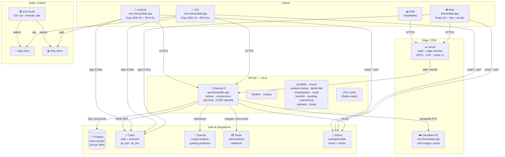
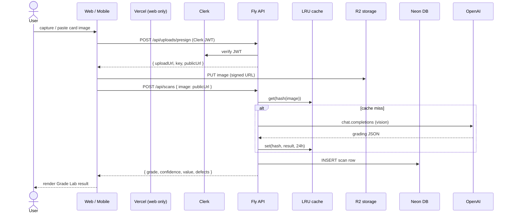
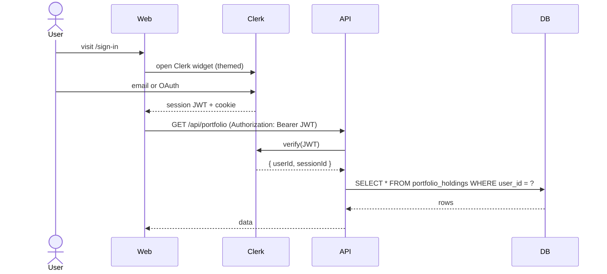
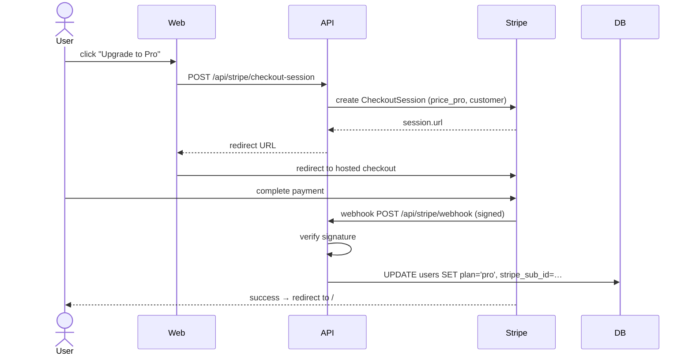
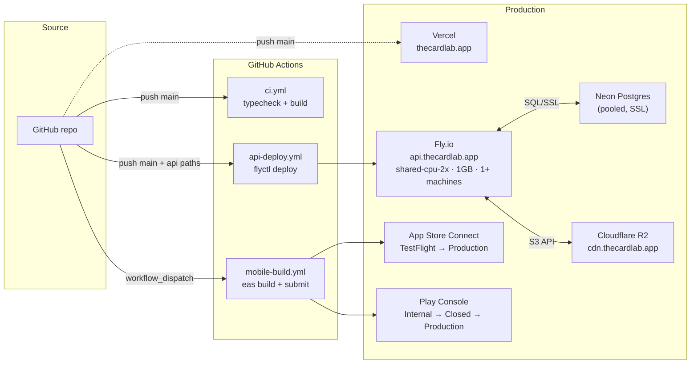

# TheCardLab — Architecture Map

## 1. High-level system



## 2. Monorepo layout

```
TheCardLab/
├── artifacts/
│   ├── thecardlab/              ← web SPA (Vercel)
│   │   ├── src/
│   │   │   ├── App.tsx          ← wouter routes (lazy) + Clerk + Query
│   │   │   ├── main.tsx         ← entry + Sentry + prefetch
│   │   │   ├── pages/           ← 15 routes (Dashboard, Portfolio, ...)
│   │   │   ├── components/      ← Sidebar, TopBar, Shell, ModalRoot
│   │   │   ├── hooks/           ← useSubscription, etc
│   │   │   ├── lib/             ← prefetch, checkout, modal-bus
│   │   │   ├── data/            ← seed mock data (cards, shows, vault)
│   │   │   ├── assets/cards/    ← AVIF + WebP + JPG hero images
│   │   │   ├── clerk-stub.tsx   ← preview-only Clerk shim
│   │   │   └── observability.ts ← Sentry init (lazy)
│   │   ├── public/              ← favicon, manifest, sw.js, sitemap, robots
│   │   ├── vite.config.ts       ← lazy chunks, Tailwind 4, alias, proxy
│   │   └── vercel.json          ← rewrites + security headers
│   │
│   ├── api-server/              ← Node API (Fly)
│   │   ├── src/
│   │   │   ├── index.ts         ← boot + Stripe init + Sentry
│   │   │   ├── app.ts           ← Express + helmet + cors + rate-limit
│   │   │   ├── routes/          ← 9 routers (health, portfolio, scans, ...)
│   │   │   ├── middlewares/     ← clerkProxyMiddleware
│   │   │   ├── stripeClient.ts  ← STRIPE_SECRET_KEY env
│   │   │   ├── webhookHandlers.ts
│   │   │   └── lib/             ← logger (pino), cache (LRU), observability
│   │   ├── build.mjs            ← esbuild bundle → dist/index.mjs
│   │   ├── Dockerfile           ← multi-stage Alpine
│   │   └── fly.toml             ← autoscale + healthcheck
│   │
│   ├── thecardlab-mobile/       ← Expo app (EAS Build → iOS + Android)
│   │   ├── app/                 ← Expo Router file-based routes
│   │   ├── components/, hooks/, constants/, lib/, data/
│   │   ├── assets/              ← icon, splash, fonts
│   │   ├── ios/                 ← Xcode project (expo prebuild)
│   │   ├── android/             ← Gradle project (expo prebuild)
│   │   ├── store/
│   │   │   ├── app-store/en-US.md  ← App Store Connect copy
│   │   │   └── play-store/en-US.md ← Play Console copy
│   │   ├── app.json             ← bundleId, plugins, splash, ITSAppUses…
│   │   └── eas.json             ← dev/preview/production profiles + submit
│   │
│   └── mockup-sandbox/          ← isolated mockup previewer (vite)
│
├── lib/
│   ├── db/                      ← Drizzle schema + pg.Pool (tuned)
│   ├── api-spec/                ← OpenAPI / Zod source
│   ├── api-zod/                 ← shared zod schemas
│   ├── api-client-react/        ← generated react-query hooks
│   ├── integrations-openai-ai-server/   ← OpenAI server SDK wrapper
│   └── integrations-openai-ai-react/    ← OpenAI client hooks
│
├── scripts/
│   └── src/
│       ├── setup-production.sh  ← idempotent bootstrap
│       ├── smoke-test.sh        ← 15-check post-deploy verify
│       ├── rollback.sh          ← api | web | mobile
│       └── pre-launch-check.sh  ← 25-check pre-flight
│
├── .github/workflows/
│   ├── ci.yml                   ← typecheck + build (PR + push)
│   ├── api-deploy.yml           ← Fly deploy on main
│   └── mobile-build.yml         ← EAS Build + Submit (manual dispatch)
│
├── DEPLOY.md                    ← full runbook (Apple, Play, Fly, Vercel, Namecheap)
├── SHIP_NOW.md                  ← zero-ambiguity 12-step launch
└── ARCHITECTURE.md              ← this file
```

## 3. Request flow — typical AI grade request



## 4. Auth flow



## 5. Subscription / Stripe flow



## 6. Deploy topology



## 7. Security boundaries

```
┌─ Browser/Device ───────────────────────────────────────┐
│  Public: pk_live (Clerk, Stripe pub key, Sentry DSN)   │
│  Storage: JWT in httpOnly cookie (Clerk)               │
│  CSP: strict (Clerk + Stripe + Sentry + R2 only)       │
└────────────────────────┬───────────────────────────────┘
                         │ HTTPS (HSTS 2y, TLS 1.3)
                         ▼
┌─ Edge (Vercel) ────────────────────────────────────────┐
│  Security headers: HSTS, X-Frame DENY, Permissions     │
│  /api/* → rewrite to api.thecardlab.app                │
└────────────────────────┬───────────────────────────────┘
                         │
                         ▼
┌─ API (Fly) ────────────────────────────────────────────┐
│  Helmet + Compression                                  │
│  CORS allowlist: thecardlab.app, www.thecardlab.app    │
│  Rate limit (auth-keyed):                              │
│    /api/analyze-listing 20/min · /api/scans 20/min     │
│    /api/uploads 120/min                                │
│  Clerk middleware verifies JWT on every request        │
│  Secrets: Fly secrets store (encrypted at rest)        │
└────────────────────────┬───────────────────────────────┘
                         │
                         ▼
┌─ Data plane ───────────────────────────────────────────┐
│  Postgres: TLS required, pooled, SSL verify            │
│  R2: presigned PUT URLs only (5min expiry)             │
│  Stripe: webhook signature verification (whsec_*)      │
│  OpenAI: server-side key, never exposed to client      │
└────────────────────────────────────────────────────────┘
```

## 8. Bundle topology (web, lazy)

```
                         ┌─────────────────────┐
                         │  index.html (3KB)   │
                         └──────────┬──────────┘
                                    │
                                    ▼
            ┌───────────────────────────────────────┐
            │  index-*.js (124KB gz)                │
            │  ↳ React, wouter, Query, Clerk, Shell │
            └──┬─────────────────────────────────┬──┘
               │ (lazy, hover/idle prefetched)   │
               │                                 │
       ┌───────┴────────┐               ┌────────┴────────┐
       │ Dashboard 2KB  │               │ Portfolio 110KB │
       │ DealScreener   │               │   (recharts)    │
       │ GradeLab       │               └─────────────────┘
       │ Marketplace    │
       │ Wantlist       │               ┌─────────────────┐
       │ ... 13 routes  │ ◄───── shares │ Pill chunk 40KB │
       └────────────────┘               │ (radix/clerk)   │
                                        └─────────────────┘
```

## 9. Build → ship pipeline

```
Developer push to main
        │
        ▼
┌─────────────────────┐
│ GitHub Actions: ci  │ ───► typecheck + build (all packages)
└─────────────────────┘
        │
        ├─► api/lib changes ──► Fly deploy (Docker, remote)
        ├─► thecardlab/**  ──► Vercel auto-deploy (preview/prod)
        └─► (manual dispatch) ──► EAS Build → Submit
                                          │
                              ┌───────────┴────────────┐
                              ▼                        ▼
                        TestFlight                Play Internal
                              │                        │
                              ▼                        ▼
                        App Store review         Play closed/open
                              │                        │
                              ▼                        ▼
                       App Store live           Play prod (staged)
```

## 10. Local dev topology

```
$ pnpm run dev                  # (per artifact)

  thecardlab        :5173   vite dev (HMR)
  mockup-sandbox    :5174   vite dev
  api-server        :8080   esbuild watch + node
  thecardlab-mobile :8081   expo start (Metro)
  Postgres          :5432   Postgres.app

  Web → /api/* proxied → :8080
  Mobile → :8080 directly (LAN IP)
  DB → :5432 (no SSL locally)
```
